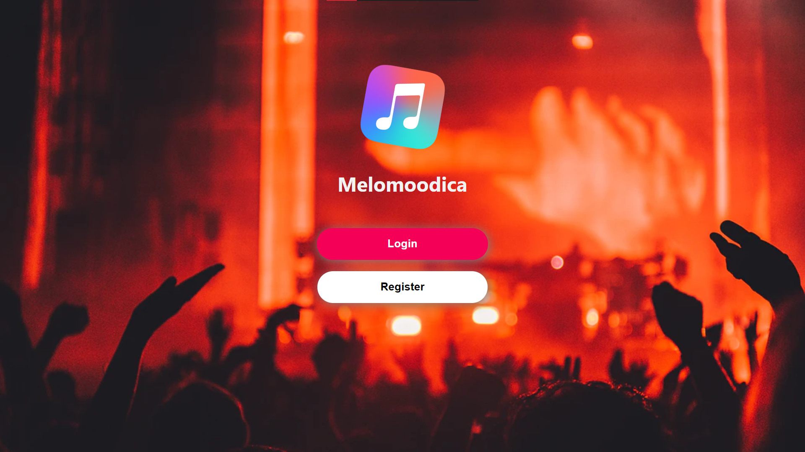
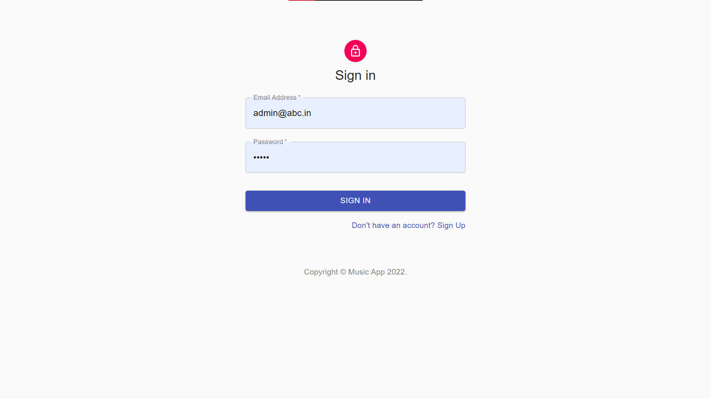
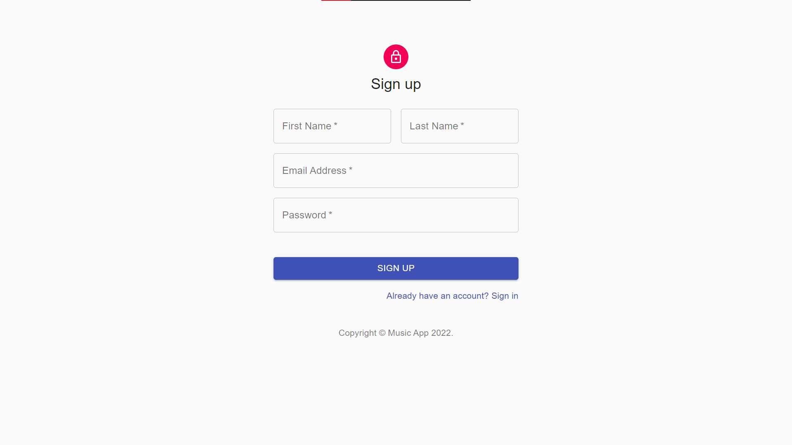
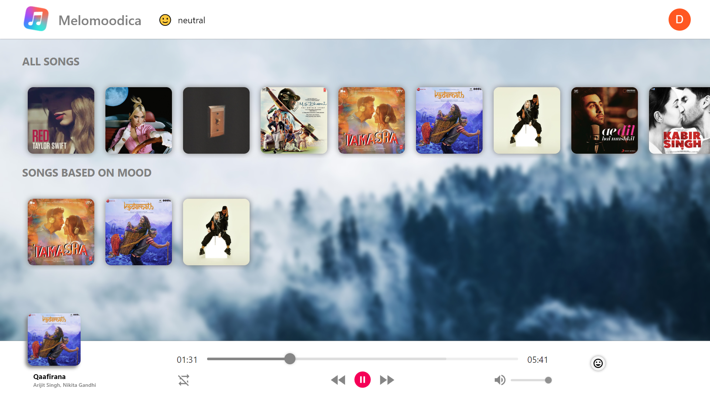
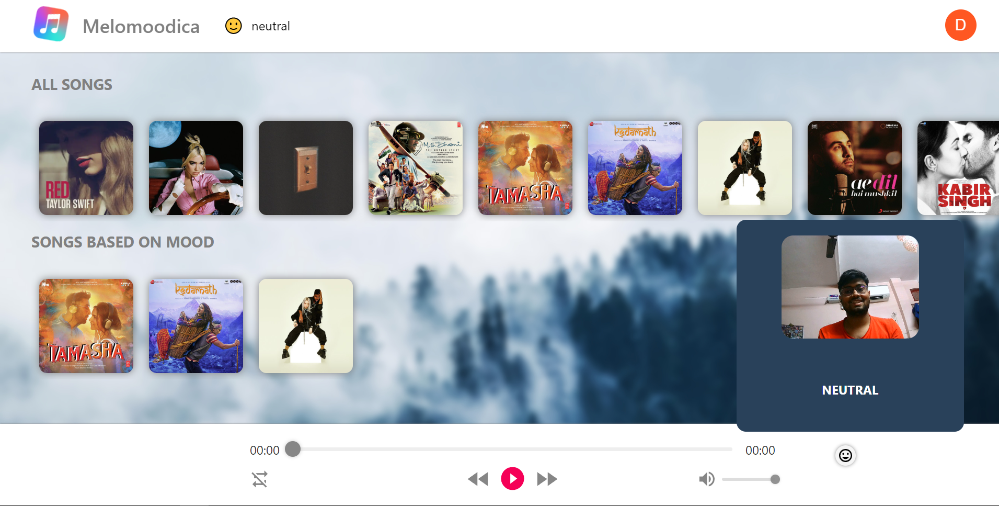
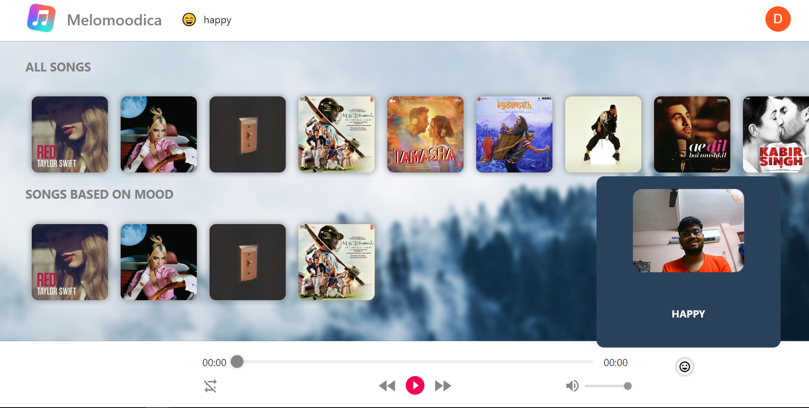
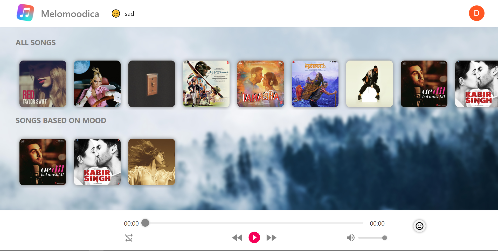
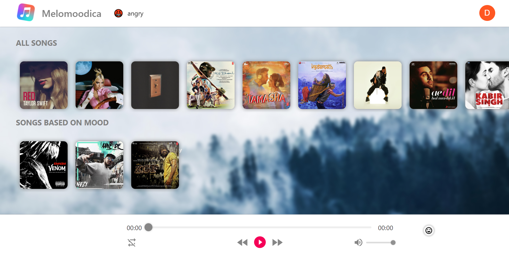

# Melomoodica Web App

### Deployed Link: https://superlative-marigold-19de0c.netlify.app/

## Introduction

Melomoodica is an online music listening platform. A user is able to register to the app and listen to music.
With the help of tensorflow.js API known as face-api.js user's current mood could be identified through their webcam feed and accordingly music would be recommended to them to listen.

It can recommend music for 4 different moods : happy, neutral, sad and angry.

## Technologies Utilised

It is MERN based project using MongoDB for database management, a popular NoSQL database management software, we will be using ReactJS for designing the front end and Express and Node JS for designing the backend, thus making it as a full stack project. A Tensorflow.js based API known as face-api.js is used for identifying and analysing the current mood of the user through their webcam feed.

## Database Description

Utilised MongoDB for storing the data. Used 2 MongoDB collections to store and use the data accordingly.

<ul>
<li>Songs - Stores the songs.</li>
<li>Users - Stores the registered users.</li>
</ul>

## Functionalities and Sneak Peak of the project

### Login / Register Screen:

### Music Playing

### For Different Moods:

<b>Neutral</b>

<b>Happy</b>

<b>Sad</b>

<b>Angry</b>

